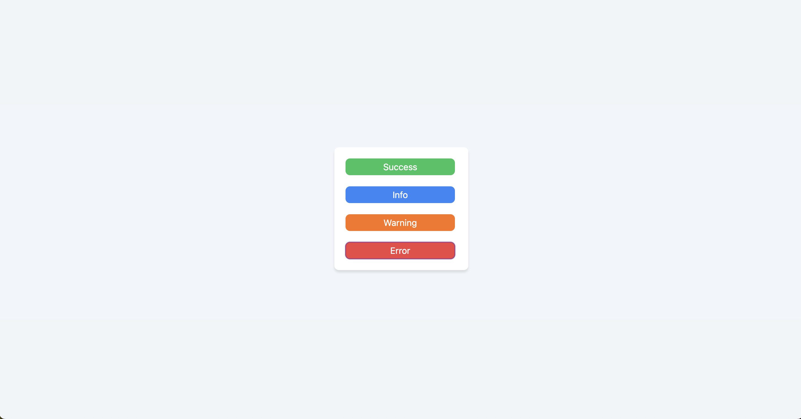

# Toast API

This project is a simple implementation of a Toast API using React's createPortal, Context API, reducer, custom hooks, and styled with Tailwind CSS. It provides an easy-to-use interface for displaying toast messages in a React application.

## Table of Contents

- [Installation](#installation)
- [License](#license)

## Installation

1.  Clone the repository:

    git clone https://github.com/SylarLTC/toast_portal_tailwind.git

2.  Navigate to the project directory:

    cd toast-api

3.  Install dependencies:

    npm install

## License

This project is licensed under the MIT License.
